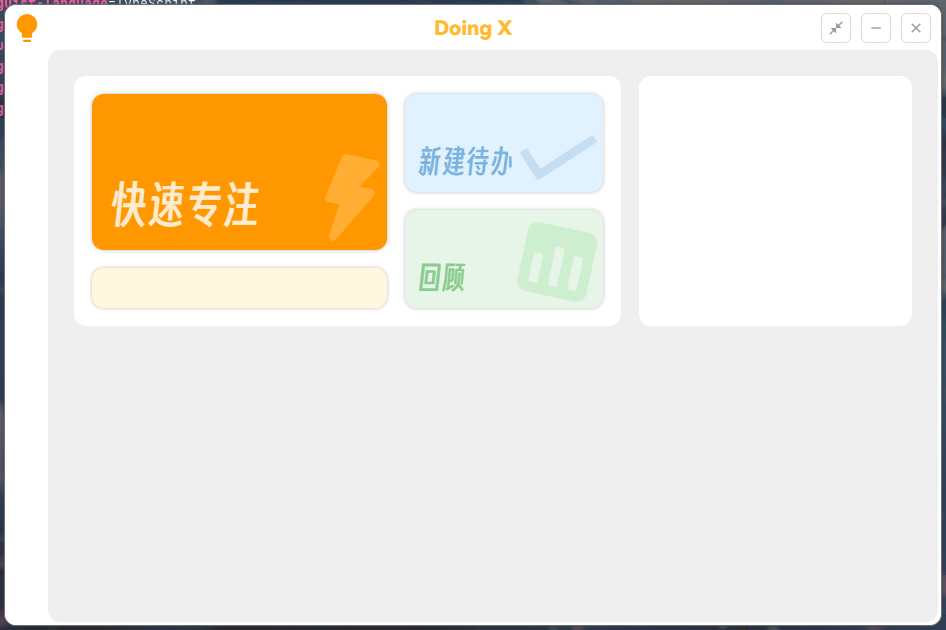

<u>尚未完成</u>

---

# 这是一个番茄钟

### 是Doing++的非官方移植版

Doing++ ： 您的生活化效率方案 ， 

基于 GTD 与番茄工作法等理论方法为您打造易实现的个人时间管理。

------

相关开源项目(无序列表)：

- [得意黑](https://github.com/atelier-anchor/smiley-sans)

- [鸿蒙OS Sans](https://developer.harmonyos.com/cn/docs/design/des-resources/general-0000001157315901)

- [思源黑体](https://github.com/adobe-fonts/source-han-sans)

---

# This is a software used to improve work efficiency

### Inspired by the mobile phone software called Doing++

Doing++: Based on theoretical methods such as GTD and tomato working method, you can create easy-to-implave personal time management.

---

Related open source projects:

- [得意黑](https://github.com/atelier-anchor/smiley-sans)

- [鸿蒙OS Sans](https://developer.harmonyos.com/cn/docs/design/des-resources/general-0000001157315901)

- [Source Han Sans](https://github.com/adobe-fonts/source-han-sans)

---

# これはあなたの仕事の効率を高めるソフトウェアです

### インスピレーションはDoing++という携帯ソフトから来ています

Doing++：GTDとトマト作業法などの理論的方法に基づいて、簡単に実現できる個人時間管理を作ります。

---

Related open source projects:

- [得意黑](https://github.com/atelier-anchor/smiley-sans)

- [鸿蒙OS Sans](https://developer.harmonyos.com/cn/docs/design/des-resources/general-0000001157315901)

- [源ノ角ゴシック](https://github.com/adobe-fonts/source-han-sans)